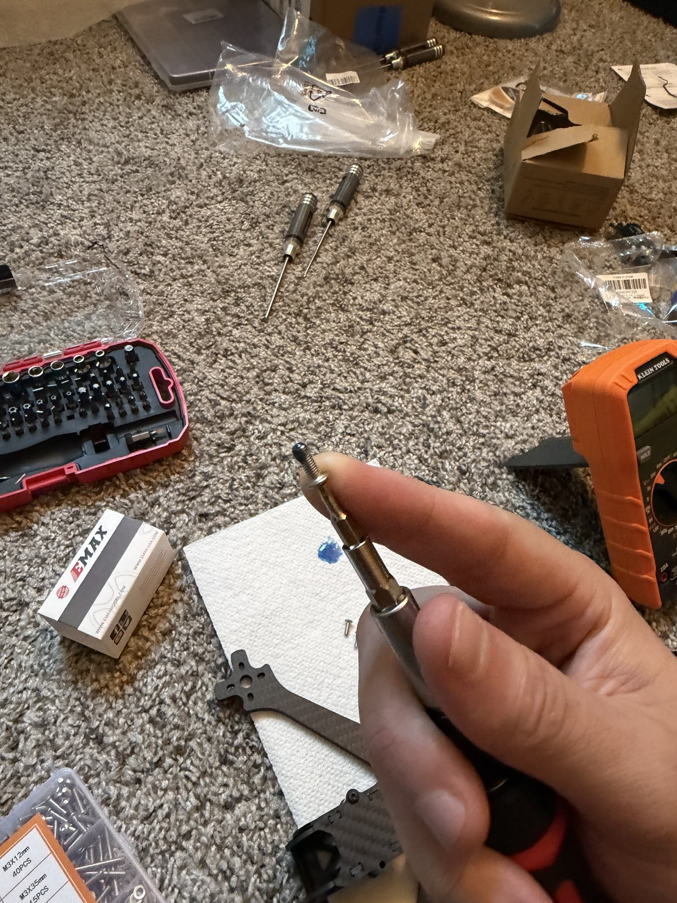

# Work Instructions — the build, routed

The build, written down the way a factory would route it: numbered work
instructions (WIs), each a sequence of operations with the tools, parts, and
checks it needs. Follow them in order. Each WI ends in a verifiable state, so a
session can stop at the end of any WI without leaving the aircraft in an
unknown condition.

Every WI is a **slide deck** — one slide per step, one photo, one check —
so the build can be walked through the same way it was done. Each deck exists
twice from one source: the markdown (readable right here on GitHub) and a
PowerPoint file generated from it.

## Index

| WI | Title | Slides | PowerPoint | Needs | Status |
|---|---|---|---|---|---|
| [WI-01](WI-01-bench-setup-and-frame.md) | Bench setup, frame assembly, motor mounting | 15 | [.pptx](WI-01-bench-setup-and-frame.pptx) | No FC | **Complete — 2026-09-20** |
| [WI-02](WI-02-esc-soldering.md) | ESC soldering — motors, XT60, capacitor | 11 | [.pptx](WI-02-esc-soldering.pptx) | No FC | **In progress** — started 2026-09-21 |
| WI-03 | FC install, pinout verification, first power-up | — | — | **FC** | Blocked on delivery (ETA Sep 22–25) |
| WI-04 | Betaflight setup → bench-alive | — | — | FC | Not started |

## How a slide is built

```markdown
## Slide 7: Bottom plate, arms, standoffs

*Op 30 · 30 min*


**Do**

1. ...

**Check:** the one observation that proves the step is done.

<sub>[◀ Prev](#slide-6-...) · [Deck](#deck) · [Next ▶](#slide-8-...)</sub>
```

- **Heading** is `Slide N: title`. The deck table at the top of the WI links
  to every slide by that heading.
- **Photo** sits directly under the heading, before the words. Until a photo
  exists the slot is an HTML comment naming the file it's waiting for, so
  nothing looks broken.
- **Do** is the action; **Check** is the observation. A slide without a check
  isn't a slide, it's a caption.
- **Safety lines are bold and come before the step they protect.**

## Adding photos — the workflow

1. **Drop phone originals into `Pictures/`** with a plain-English filename
   (`Loctite on screw.jpeg`). That folder is git-ignored: it's the inbox, and
   5 MB originals never enter the repository.
2. **Import each one** into the WI it belongs to. This applies the phone's
   rotation, strips every bit of metadata (phone photos carry GPS — this repo
   is public), and resizes to 1600 px / ~300 KB:

   ```
   python tools/import-photo.py "Pictures/Loctite on screw.jpeg" images/wi-01/10c-loctite-on-screw.jpg
   ```

   Names are `SS-short-description.jpg` — `SS` is the slide number, with a
   letter suffix (`05a`, `05b`) when a slide has more than one photo.
3. **Wire it into the slide** — replace the `<!-- photo: … -->` comment with an
   image tag (several in a row is fine; the PowerPoint puts them side by side):

   ```markdown
   
   ```
4. **Rebuild the PowerPoint:**

   ```
   python tools/build-decks.py          # regenerates every WI-*.pptx from its .md
   ```

   It prints which photo slots are still empty — that list is the shot list
   for the next bench session.

## Regenerating the PowerPoint decks

[tools/build-decks.py](tools/build-decks.py) reads each `WI-*.md`, turns every
`## Slide N:` section into a slide — title, op/time, photo (or a labelled slot
if the file isn't there yet), the **Do** list, any bold safety line as a
CAUTION card, and the **Check** as a card anchored to the bottom — and writes
`WI-*.pptx` next to it. Needs `pip install python-pptx pillow`. The markdown is
the source; never edit the .pptx by hand.

## Rules for writing a WI

1. **One WI = one sitting.** If it can't be done in an evening, split it.
2. Slide 1 is always **tools & parts on the bench** — nothing mid-deck should
   send you hunting.
3. Every slide that can be verified gets a **Check**. A WI is done when every
   check passed, not when the steps were attempted.
4. The last slide is the **end state** — the list of things that must all be
   true for the WI to be closed.
5. Write down what actually happened, including mistakes — this is also the
   raw material for the [build log](../../build-log/) and the [blog](../../blog/).
