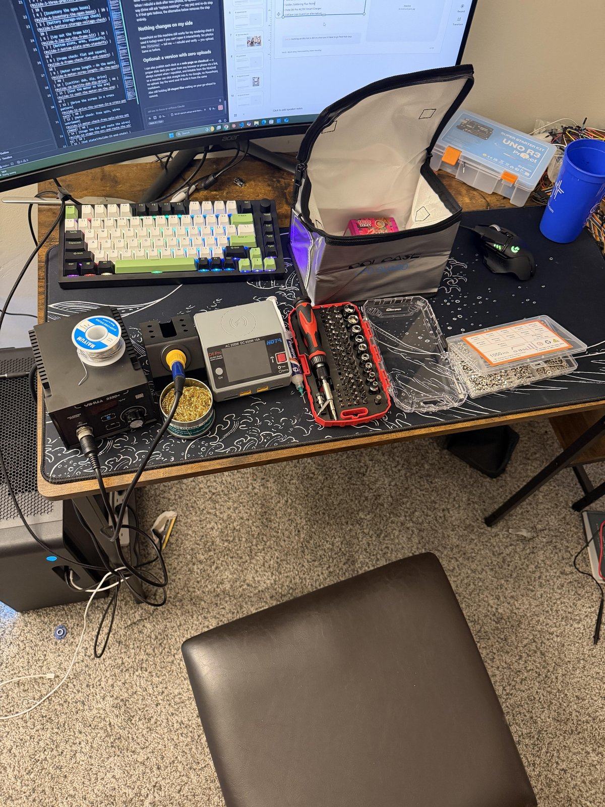
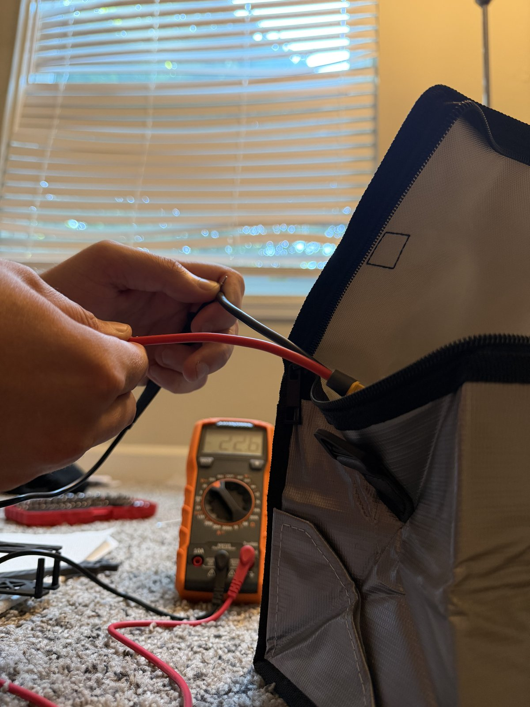
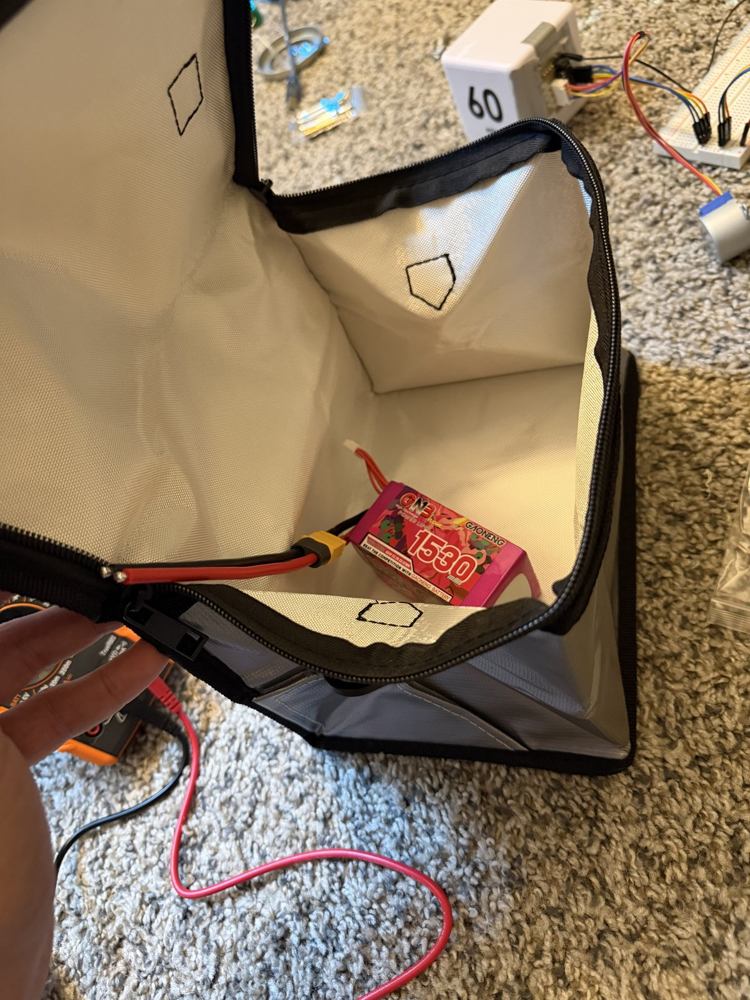
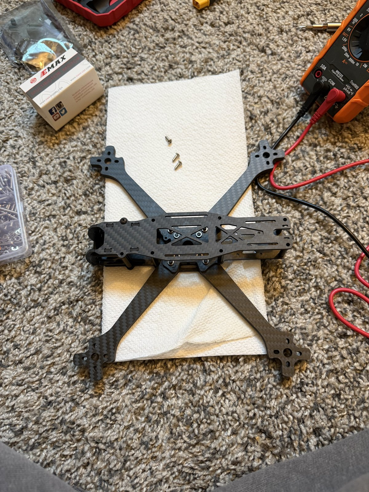
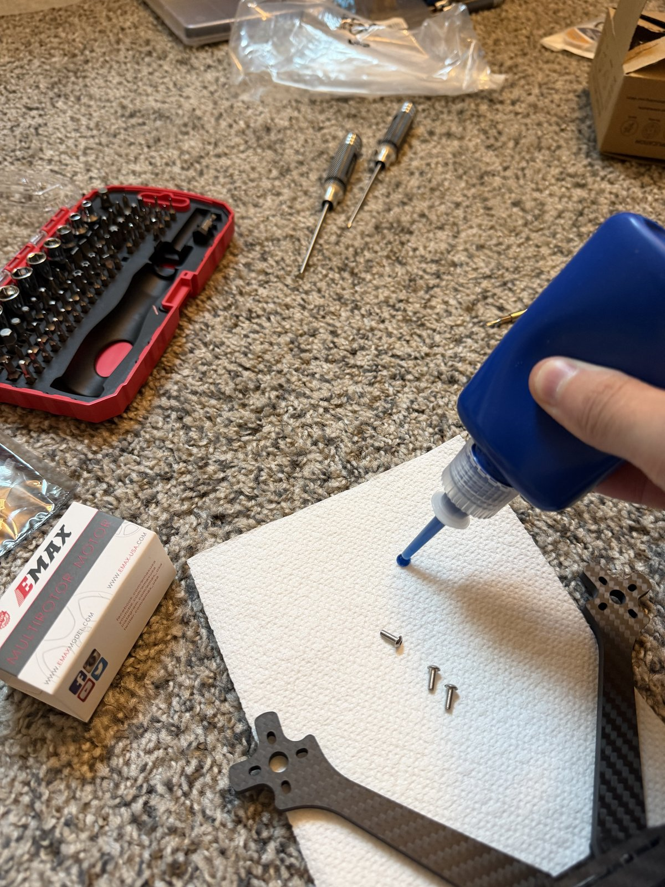
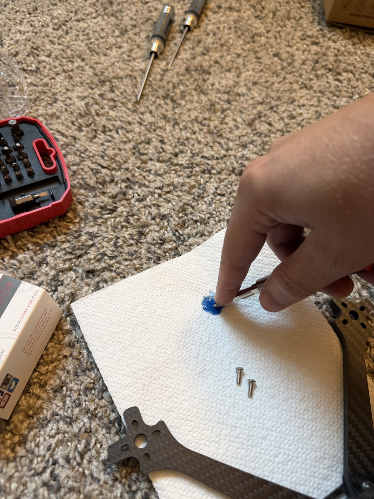
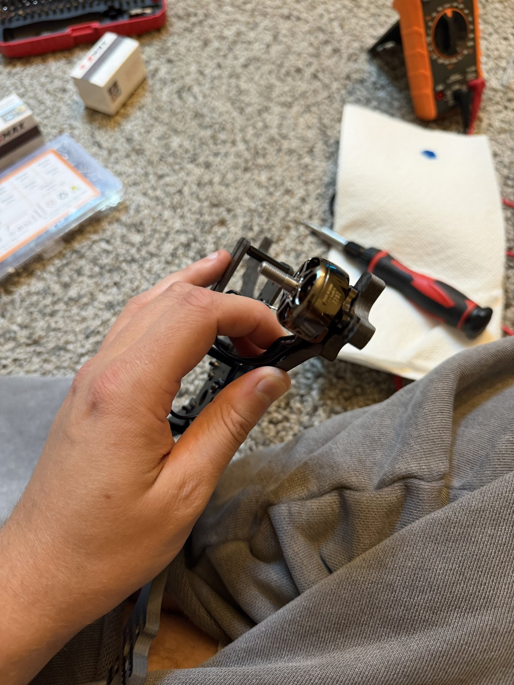
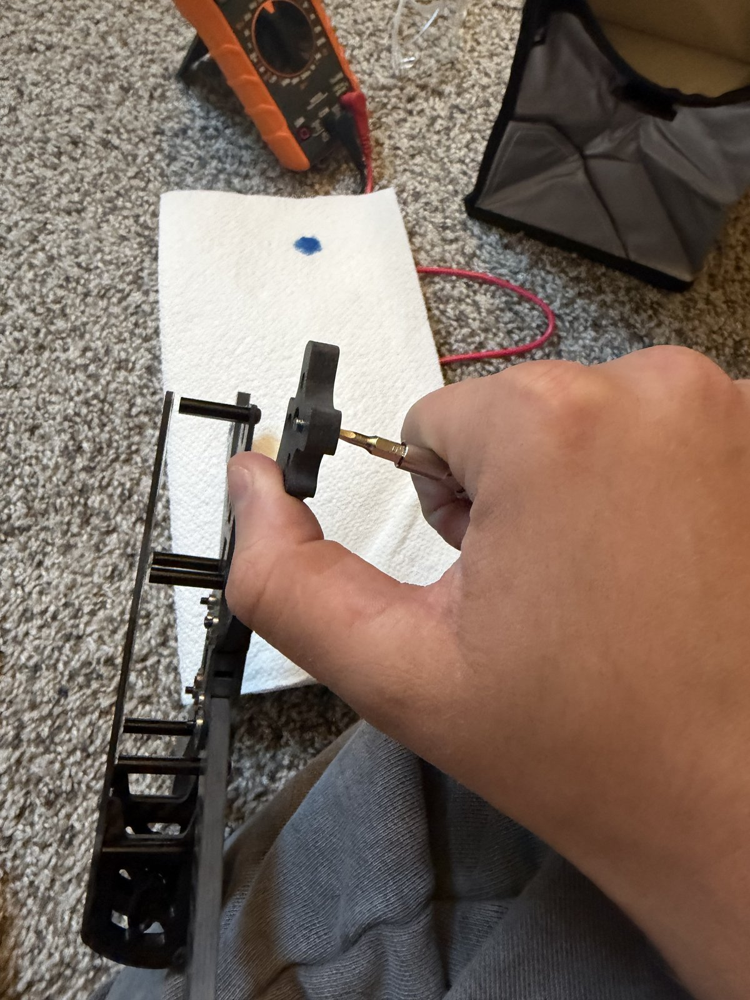
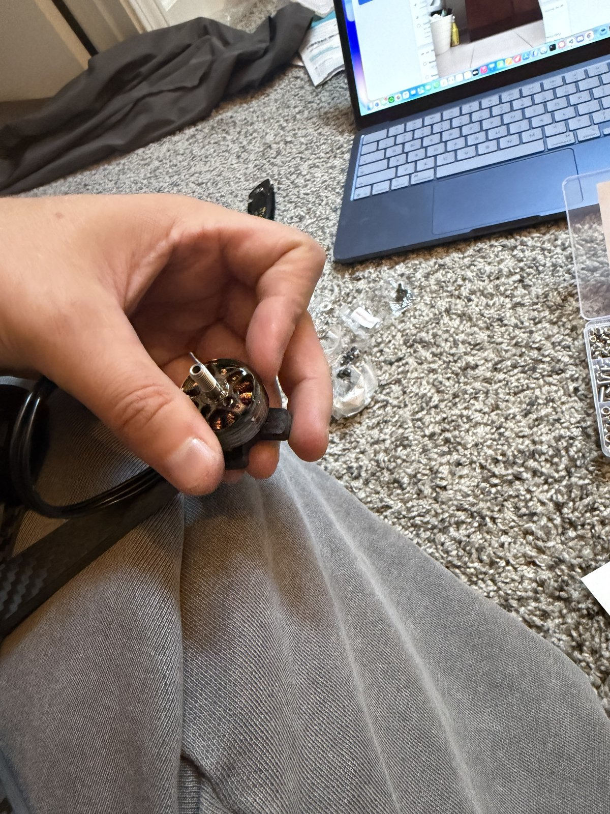
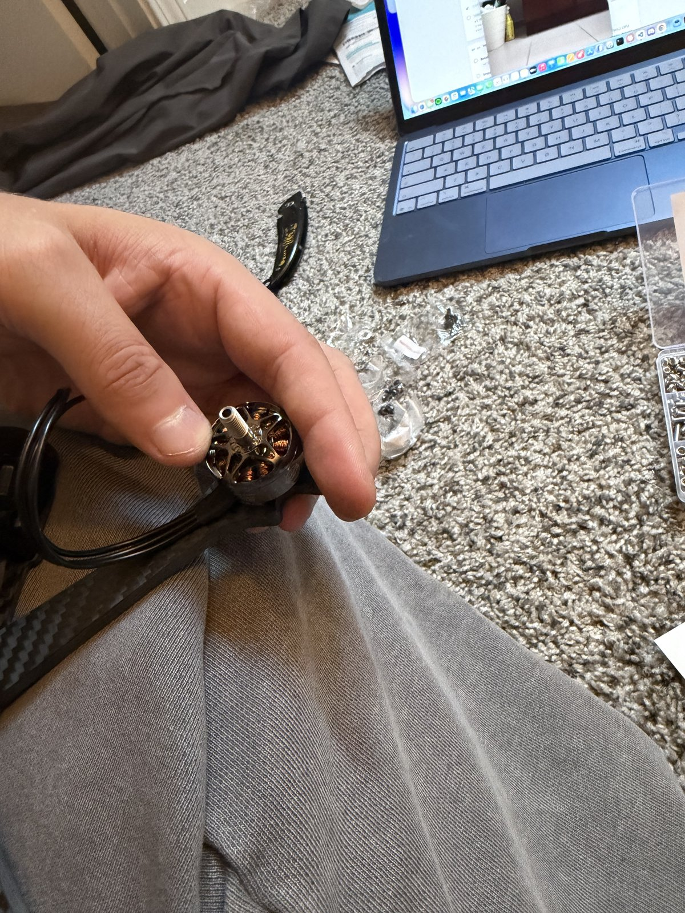

# WI-01 — Bench setup, frame assembly, motor mounting

| | |
|---|---|
| **Status** | **Complete — 2026-09-20** |
| **Needs** | Everything that has arrived. **Not** the flight controller. |
| **Battery** | Stays in the LiPo bag for the entire WI. Not needed, not used. |
| **Time** | ~1 h 45 min across four operations |

This WI is a slide deck: one slide per step, one photo, and the check that
proves the step is done. Walk it with the **Next ▶** link at the bottom of each
slide, or jump in from the deck list. Slide deck of the whole build:
[Project-One-Build-Walkthrough.pptx](Project-One-Build-Walkthrough.pptx).

## Deck

| # | Slide | Op |
|---|---|---|
| 1 | [Tools & parts on the bench](#slide-1-tools--parts-on-the-bench) | — |
| 2 | [Prove the iron: heat, hold, tin](#slide-2-prove-the-iron-heat-hold-tin) | 10 |
| 3 | [Battery storage-voltage check](#slide-3-battery-storage-voltage-check) | 20 |
| 4 | [Lay out the frame kit](#slide-4-lay-out-the-frame-kit) | 30 |
| 5 | [Bottom plate, arms, standoffs](#slide-5-bottom-plate-arms-standoffs) | 30 |
| 6 | [Frame check: flat and square](#slide-6-frame-check-flat-and-square) | 30 |
| 7 | [Motor screw length — do the math](#slide-7-motor-screw-length--do-the-math) | 40 |
| 8 | [Loctite: dab, dip, drive](#slide-8-loctite-dab-dip-drive) | 40 |
| 9 | [Seat the motor on the arm](#slide-9-seat-the-motor-on-the-arm) | 40 |
| 10 | [Drive the screws in a cross pattern](#slide-10-drive-the-screws-in-a-cross-pattern) | 40 |
| 11 | [Motor check: free spin, wires untrimmed](#slide-11-motor-check-free-spin-wires-untrimmed) | 40 |

---

## Slide 1: Tools & parts on the bench

**On the bench before starting**

- Soldering station — YIHUA 939D+ (75 W) with the largest chisel tip
- Hex driver set, multimeter, calipers if you have them
- Safety glasses
- Loctite 243 (blue)
- Frame kit — TBS Source One V6, 5"
- Motors ×4 — EMAX ECO II 2207 1900KV
- M3 screw assortment
- ESC — Skystars KO60II 60A AM32
- Solder, flux, wick, scrap wire, heat shrink

**Check:** nothing on this list is still in a box you'd have to go find mid-step.

[Deck](#deck) · [Next ▶](#slide-2-prove-the-iron-heat-hold-tin)

---

## Slide 2: Prove the iron: heat, hold, tin

*Op 10 · 5 min*

<!-- photo: images/wi-01/02-iron-at-temperature.jpg -->

The AiXun sat in its box, turned out to be defective, and cost a week. The
first thing the new iron does is prove it works.

**Do**

1. Power on the YIHUA. Set **350 °C / 662 °F**.
2. Fit the **largest chisel tip**.
3. Tin it — touch solder to the hot tip.

**Check:** display reaches and *holds* temperature. Solder flows and coats the
tip instantly; if it balls up, the tip isn't hot or isn't clean.

[◀ Prev](#slide-1-tools--parts-on-the-bench) · [Deck](#deck) · [Next ▶](#slide-3-battery-storage-voltage-check)

---

## Slide 3: Battery storage-voltage check

*Op 20 · 5 min*

**Do**

1. Multimeter on DC volts.
2. Measure pack voltage at the XT60 — red probe to the + pin, black to −.
3. Straight back into the LiPo bag.

**Check:** **~22.2–22.8 V** for a 6S pack at storage charge (3.7–3.8 V per
cell). Anything far outside that range is a question for the charger, not the
bench.

[◀ Prev](#slide-2-prove-the-iron-heat-hold-tin) · [Deck](#deck) · [Next ▶](#slide-4-lay-out-the-frame-kit)

---

## Slide 4: Lay out the frame kit

*Op 30 · 10 min*

<!-- photo: images/wi-01/04-frame-kit-layout.jpg -->

**Do**

1. Lay out every Source One V6 plate, arm, standoff, and bag of hardware
   against the kit sheet.
2. Sort the hardware by length. The kit's **M3×10 / 12 / 14 screws are
   standoff hardware — they are not motor screws.**

**Check:** everything on the kit sheet is present and sorted before a single
screw is driven.

[◀ Prev](#slide-3-battery-storage-voltage-check) · [Deck](#deck) · [Next ▶](#slide-5-bottom-plate-arms-standoffs)

---

## Slide 5: Bottom plate, arms, standoffs

*Op 30 · 30 min*

**Do**

1. Bottom plate first, then the four arms, then the standoffs.
2. **One drop of blue Loctite** on each frame bolt.
3. **Snug, not gorilla-tight.** Carbon fibre crushes under an over-torqued bolt
   and there is no undoing it.

**Check:** every frame bolt has Loctite and is snug; no bolt bottomed out.

[◀ Prev](#slide-4-lay-out-the-frame-kit) · [Deck](#deck) · [Next ▶](#slide-6-frame-check-flat-and-square)

---

## Slide 6: Frame check: flat and square

*Op 30 · 5 min*

<!-- photo: images/wi-01/06-frame-flat-check.jpg -->

**Do**

1. Set the assembled frame on a flat surface and press each arm tip.
2. Sight down the stack holes.

**Check:** no rock on any arm. Stack holes line up on the **30 × 30 mm**
pattern — the FC and ESC both mount to it.

[◀ Prev](#slide-5-bottom-plate-arms-standoffs) · [Deck](#deck) · [Next ▶](#slide-7-motor-screw-length--do-the-math)

---

## Slide 7: Motor screw length — do the math

*Op 40 · 10 min*

<!-- photo: images/wi-01/07-screw-length-measure.jpg -->

**Wrong screw length is the #1 motor killer. A screw that reaches the windings
shorts the motor the first time it spins. Do the math before driving any screw.**

**Do**

1. Measure arm thickness — calipers, or the edge of the multimeter case (~6 mm).
2. Measure the motor's blind-hole depth.
3. Target thread into the motor = **arm + ~5 mm**. Pick screws from the
   assortment to match.

**Check:** test-fit a screw through the arm into a motor by hand — the tip sits
**at least 1 mm short** of the hole bottom.

[◀ Prev](#slide-6-frame-check-flat-and-square) · [Deck](#deck) · [Next ▶](#slide-8-loctite-dab-dip-drive)

---

## Slide 8: Loctite: dab, dip, drive

*Op 40 · 5 min*

The bottle nozzle puts far too much on a screw this small. Dab, then dip.

**Do**

1. Squeeze **one drop** of blue Loctite 243 onto a paper towel.
2. Touch each screw's threads into the drop — a thin film, not a coating.
3. Drive it within a minute or two, before it starts to set.

**Check:** blue on the threads only, none on the screw head or the carbon.

[◀ Prev](#slide-7-motor-screw-length--do-the-math) · [Deck](#deck) · [Next ▶](#slide-9-seat-the-motor-on-the-arm)

---

## Slide 9: Seat the motor on the arm

*Op 40 · 10 min*

**Safety glasses on.**

**Do**

1. Set the motor on the arm end, bolt holes aligned with the arm's
   16 × 16 mm pattern.
2. Wires pointing **inboard**, toward the centre of the frame.
3. Hold it flat while the first screw goes in.

**Check:** motor base sits flush on the arm, all four holes visible through the
arm, wires headed toward the stack.

[◀ Prev](#slide-8-loctite-dab-dip-drive) · [Deck](#deck) · [Next ▶](#slide-10-drive-the-screws-in-a-cross-pattern)

---

## Slide 10: Drive the screws in a cross pattern

*Op 40 · 20 min*

**Do**

1. Screws go up **through the arm, into the motor** — from underneath.
2. Drive them in a **cross pattern** — one corner, then the opposite corner,
   then the other pair — so the motor seats flat, not tilted.
3. Snug only. Same rule as the frame bolts.
4. Repeat for all four motors.

**Check:** all 16 screws in, all Loctited, no gap between motor base and arm on
any motor.

[◀ Prev](#slide-9-seat-the-motor-on-the-arm) · [Deck](#deck) · [Next ▶](#slide-11-motor-check-free-spin-wires-untrimmed)

---

## Slide 11: Motor check: free spin, wires untrimmed

*Op 40 · 5 min*

**Do**

1. Spin each motor bell by hand — both directions.
2. Leave every motor wire at full length.

**Check:** each motor spins freely both ways — no scraping, no wobble, no tick.
A tick means a screw is touching the windings: **back it out now.** **Do not
trim motor wires yet;** they get cut to length once the ESC is staged, first
thing in WI-02.

**WI-01 is done when:** iron proven, battery at storage voltage and back in the
bag, frame assembled and flat, four motors mounted with verified screw length
and spinning free.

**Next:** [WI-02 — ESC soldering](WI-02-esc-soldering.md)

[◀ Prev](#slide-10-drive-the-screws-in-a-cross-pattern) · [Deck](#deck) · [Work instructions index](README.md)
