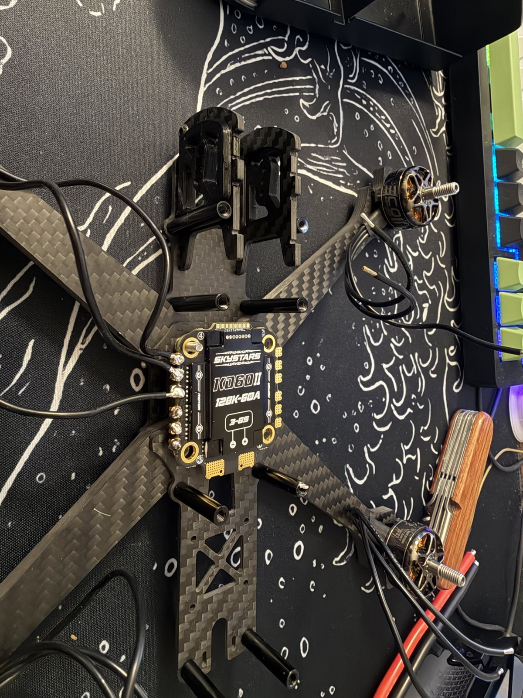
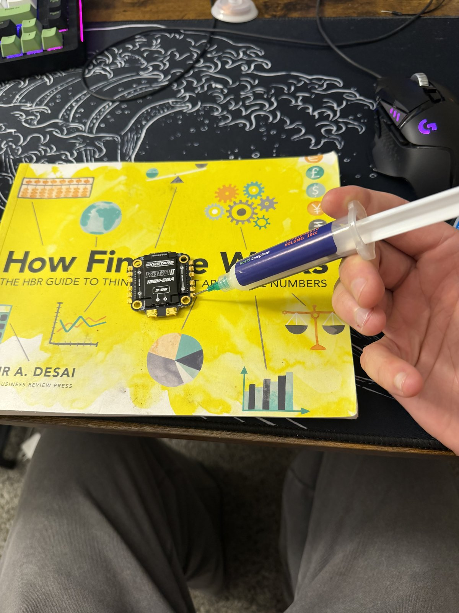

# WI-02 — ESC soldering: motors, XT60, capacitor

| | |
|---|---|
| **Status** | **In progress** — started 2026-09-21 |
| **Needs** | WI-01 complete. **Not** the flight controller — it connects to the ESC by a plug-in cable, so none of these joints wait on it. |
| **Battery** | **None in this WI.** First power-up is WI-03, through the smoke stopper, after the pinout check. |
| **Time** | ~2 h 40 min across three operations — 14 joints total |

One slide per step, one photo, one check. **Next ▶** at the bottom of each
slide, or jump in from the deck list. Slide deck of the whole build:
[Project-One-Build-Walkthrough.pptx](Project-One-Build-Walkthrough.pptx).

## Deck

| # | Slide | Op |
|---|---|---|
| 1 | [Tools & parts on the bench](#slide-1-tools--parts-on-the-bench) | — |
| 2 | [Trim, strip, and tin the motor wires](#slide-2-trim-strip-and-tin-the-motor-wires) | 10 |
| 3 | [Tin the twelve ESC motor pads](#slide-3-tin-the-twelve-esc-motor-pads) | 10 |
| 4 | [Solder each motor wire to its pad](#slide-4-solder-each-motor-wire-to-its-pad) | 10 |
| 5 | [Inspect: cone, no bridge, tug test](#slide-5-inspect-cone-no-bridge-tug-test) | 10 |
| 6 | [Heat shrink goes on first](#slide-6-heat-shrink-goes-on-first) | 20 |
| 7 | [XT60 to the battery pads](#slide-7-xt60-to-the-battery-pads) | 20 |
| 8 | [Capacitor across the battery pads](#slide-8-capacitor-across-the-battery-pads) | 20 |
| 9 | [Shrink everything, no exposed copper](#slide-9-shrink-everything-no-exposed-copper) | 20 |
| 10 | [Continuity audit](#slide-10-continuity-audit) | 30 |
| 11 | [End state](#slide-11-end-state) | — |

---

## Slide 1: Tools & parts on the bench

<!-- photo: images/wi-02/01-tools-and-parts.jpg -->

**On the bench before starting**

- Iron with the **largest chisel tip**
- Solder (63/37), flux, wick
- Side cutters, wire strippers
- Heat shrink — sized for the motor wires and for the XT60 leads
- Helping-hands station with magnifier (from Day 3 on)
- ESC — Skystars KO60II
- XT60 pigtail (or the one from the ESC box)
- Capacitor — **read the can: 1000 µF 35 V.** The stripe side is negative.
  A 25 V cap blows on 6S.
- Safety glasses

**Check:** the battery is in its bag, somewhere else. It does not come to the
bench today.

[Deck](#deck) · [Next ▶](#slide-2-trim-strip-and-tin-the-motor-wires)

---

## Slide 2: Trim, strip, and tin the motor wires

*Op 10 · 30 min*

**Do**

1. Dry-fit the ESC on the stack standoffs, **arrow / battery pads facing the
   rear** of the aircraft. Route each motor's three wires to its corner.
2. Cut each wire so it reaches its pads with a little slack and crosses no
   prop line. Strip **~2 mm** of insulation.
3. Flux each bare end and tin it — iron under, solder on top, until the
   strands wick full. Twelve wires.

**Check:** every wire reaches its pads with slack to spare; each tinned end is
a smooth silver cylinder, not a blob, with no stray strands.

[◀ Prev](#slide-1-tools--parts-on-the-bench) · [Deck](#deck) · [Next ▶](#slide-3-tin-the-twelve-esc-motor-pads)

---

## Slide 3: Tin the twelve ESC motor pads

*Op 10 · 15 min*

**Do**

1. Flux every motor pad.
2. Iron at **350–370 °C**.
3. Put a small blob of solder on each pad — the pad should wet and the blob
   should sit domed, not spread.

**Check:** twelve shiny domes, none touching a neighbor.

[◀ Prev](#slide-2-trim-strip-and-tin-the-motor-wires) · [Deck](#deck) · [Next ▶](#slide-4-solder-each-motor-wire-to-its-pad)

---

## Slide 4: Solder each motor wire to its pad

*Op 10 · 45 min*

<!-- photo: images/wi-02/04-solder-motor-wire.jpg -->

**Do** — one joint at a time, twelve times:

1. Lay the tinned wire on its pad.
2. Iron on pad **and** wire together.
3. Feed a little solder into the joint.
4. Hold still for **2 seconds** after the iron lifts — moving a cooling joint
   makes a cold one.

Wire order within a corner doesn't matter — motor direction is fixed in
software later.

**Check:** the wire doesn't move when nudged, and the solder flowed onto both
pad and wire.

[◀ Prev](#slide-3-tin-the-twelve-esc-motor-pads) · [Deck](#deck) · [Next ▶](#slide-5-inspect-cone-no-bridge-tug-test)

---

## Slide 5: Inspect: cone, no bridge, tug test

*Op 10 · 10 min*

<!-- photo: images/wi-02/05-inspect-joints.jpg -->

**Do** — under the magnifier, every joint:

1. Look for a **shiny cone** climbing from pad to wire.
2. Look between neighbors for any bridge.
3. Tug each wire, gently.

**Check:** twelve shiny cones, no dull balls, no bridges, no movement. Any joint
that fails gets wicked and redone — not reheated and hoped for.

[◀ Prev](#slide-4-solder-each-motor-wire-to-its-pad) · [Deck](#deck) · [Next ▶](#slide-6-heat-shrink-goes-on-first)

---

## Slide 6: Heat shrink goes on first

*Op 20 · 2 min*

<!-- photo: images/wi-02/06-heat-shrink-on-leads.jpg -->

**Do**

1. Cut a length of heat shrink for each XT60 lead.
2. Slide both pieces onto the leads **now**, pushed well back from the ends.

**Check:** two pieces of shrink on the leads before the iron gets near them. It
cannot go on after the joint is made.

[◀ Prev](#slide-5-inspect-cone-no-bridge-tug-test) · [Deck](#deck) · [Next ▶](#slide-7-xt60-to-the-battery-pads)

---

## Slide 7: XT60 to the battery pads

*Op 20 · 25 min*

<!-- photo: images/wi-02/07-xt60-battery-pads.jpg -->

**These are the two big joints. Max temperature (480 °C), largest tip,
patience. Let the pad fully wet before feeding solder — 75 W needs a few extra
seconds, not force.**

**Do**

1. Tin the two big pads generously.
2. **Red → +, black → −.** Triple-check before the iron touches. Reversed
   polarity destroys the ESC instantly.
3. Tinned lead on tinned pad, iron on both, feed solder until it flows
   through, hold still to cool.

**Check:** both leads solid, polarity confirmed against the ESC silkscreen a
fourth time.

[◀ Prev](#slide-6-heat-shrink-goes-on-first) · [Deck](#deck) · [Next ▶](#slide-8-capacitor-across-the-battery-pads)

---

## Slide 8: Capacitor across the battery pads

*Op 20 · 15 min*

<!-- photo: images/wi-02/08-capacitor.jpg -->

**Do**

1. Trim the capacitor legs short — it sits close to the board.
2. **Stripe to −.** The stripe on the can marks the negative leg.
3. Solder each leg to the same battery pads as the XT60.

**Check:** 1000 µF 35 V, stripe on the − pad, legs not touching anything else.

[◀ Prev](#slide-7-xt60-to-the-battery-pads) · [Deck](#deck) · [Next ▶](#slide-9-shrink-everything-no-exposed-copper)

---

## Slide 9: Shrink everything, no exposed copper

*Op 20 · 5 min*

<!-- photo: images/wi-02/09-shrink-done.jpg -->

**Do**

1. Slide the shrink from slide 6 down over the XT60 joints.
2. Shrink it — iron barrel held near, rotate; or the lower half of a lighter
   flame, kept moving.

**Check:** no exposed copper anywhere on the battery side of the ESC.

[◀ Prev](#slide-8-capacitor-across-the-battery-pads) · [Deck](#deck) · [Next ▶](#slide-10-continuity-audit)

---

## Slide 10: Continuity audit

*Op 30 · 20 min*

<!-- photo: images/wi-02/10-continuity-audit.jpg -->

**Multimeter on continuity. No battery anywhere near the bench.**

**Do**

1. XT60 **+ to −**.
2. Each motor wire to **its own** pad, then to each **neighbor** pad.
3. **+ pad** to every motor pad and to the frame; **− pad** likewise.

**Check**

- + to − reads **OPEN**. A brief blip while the capacitor charges is fine; a
  solid beep is a short — **stop and find it.**
- Every motor wire beeps to its own pad only.
- Neither battery pad beeps to any motor pad or to the frame (intended grounds
  excepted).

[◀ Prev](#slide-9-shrink-everything-no-exposed-copper) · [Deck](#deck) · [Next ▶](#slide-11-end-state)

---

## Slide 11: End state

<!-- photo: images/wi-02/11-end-state.jpg -->

**WI-02 is done when all of these are true:**

- Twelve motor joints soldered, inspected, tug-tested
- XT60 on the battery pads, polarity confirmed, shrink over both joints
- 1000 µF 35 V capacitor across the pads, stripe to −
- Continuity audit passed — no shorts, no crossed pads
- **The powertrain has still never been powered.**

**Next:** WI-03 — FC install, pinout check, first power through the smoke
stopper. Unblocks when the SkyStars H743 lands.

[◀ Prev](#slide-10-continuity-audit) · [Deck](#deck) · [Work instructions index](README.md)
