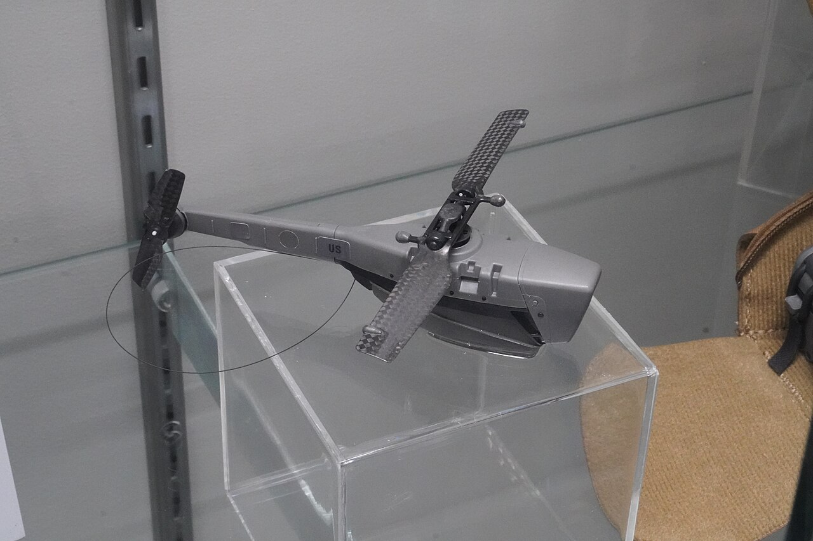
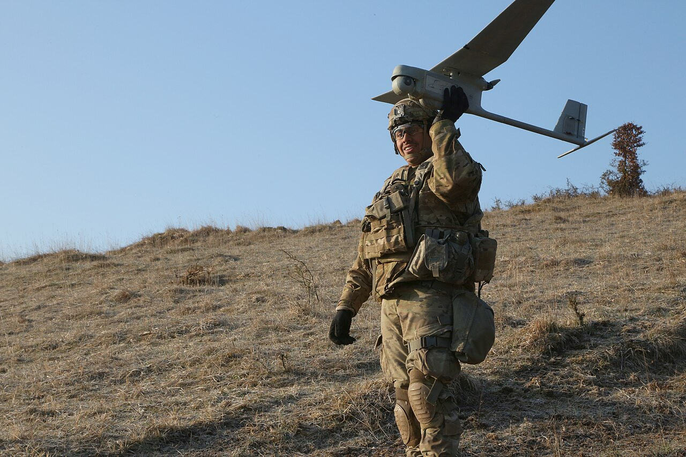
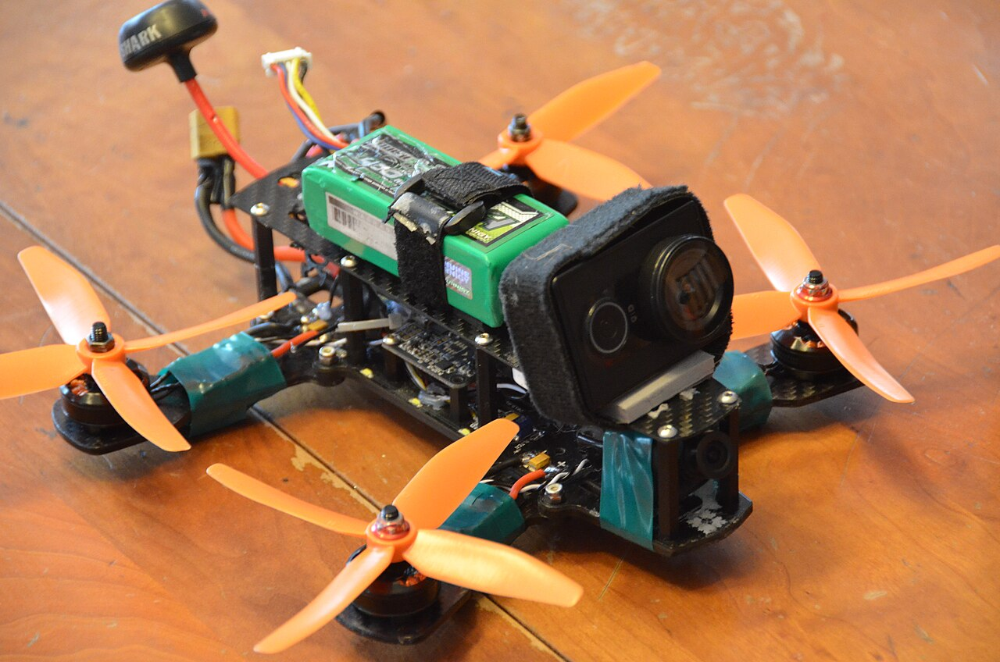
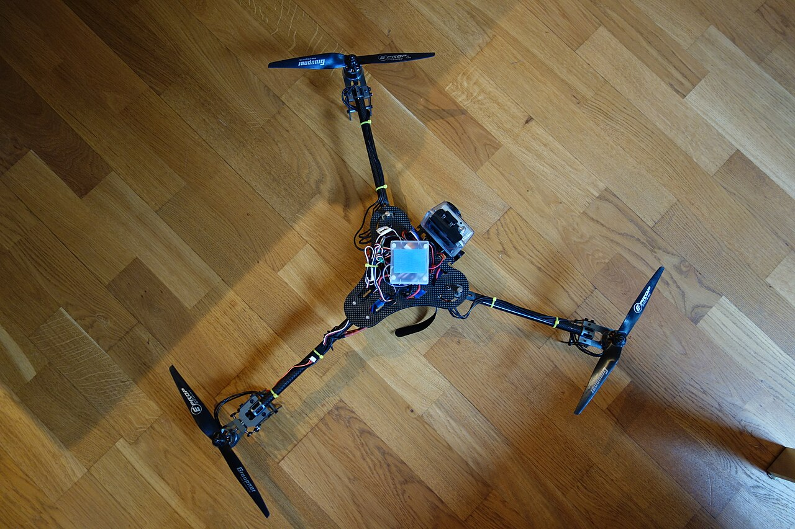
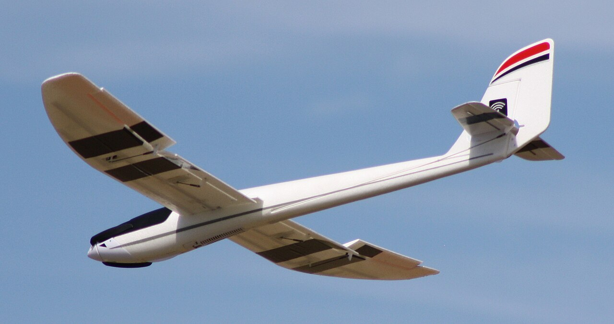
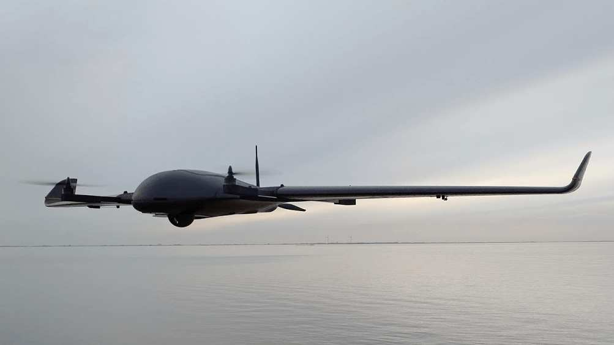
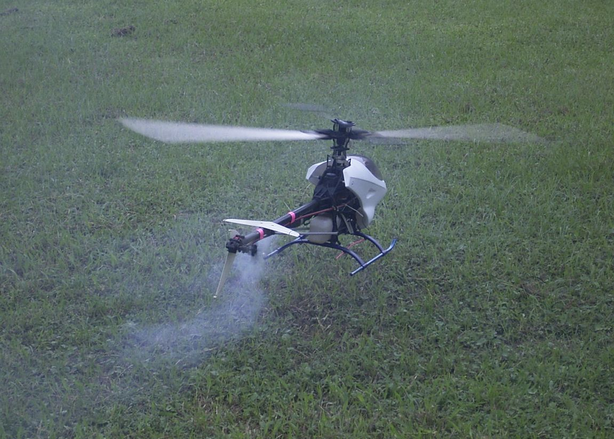
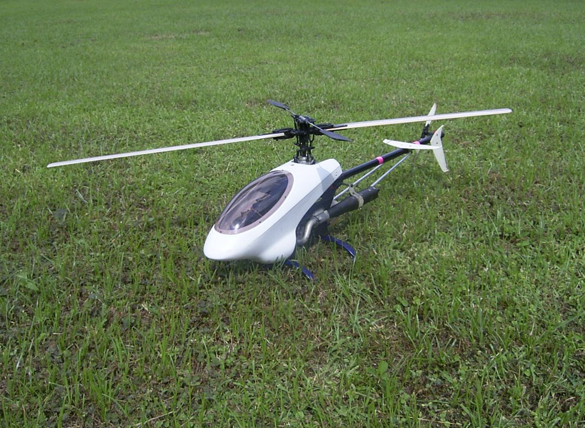

# Group 1 — Small UAS

> **< 20 lb (9 kg) · < 1,200 ft AGL · < 100 kt**

**This is your group.** Everything you could realistically design, build, fly, or legally operate as an individual lives here — and so does an enormous range of military hardware, from 33-gram pocket helicopters to 19-pound quadplanes. This file gets the deepest treatment because it's the only group where the decisions are yours to make.

---

## In general

Group 1 is the drone you can pick up with one hand.

It covers everything from a device that fits in a jacket pocket to something about the size and weight of a full grocery bag. If you have ever seen a drone in person — a camera drone at a park, a racing quad at a club field, a delivery demo, a toy at a hobby shop — it was almost certainly Group 1. When a news story says "drone," this is usually what it means.

The defining characteristic is **self-sufficiency**: one person carries it, launches it by hand or by letting it lift off vertically, flies it while watching it or through a camera feed, and picks it up afterwards. There is no supporting equipment. No runway, no launcher, no crew, no ground station beyond a handheld controller. That independence is what makes the group accessible, and it's why this is the only tier an individual can meaningfully participate in.

These aircraft are almost universally battery-powered and electric, which makes them quiet, simple, and relatively safe, but limits them to somewhere between a few minutes and a couple of hours in the air. They fly low and slowly by aviation standards. They're cheap enough that losing one is an annoyance rather than a disaster — an idea that has quietly reshaped military aviation too, where small drones are increasingly treated as expendable.

The catch is that "Group 1" is an extremely broad label. A 33-gram reconnaissance helicopter and a 9-kilogram mapping aircraft are both Group 1, and they have almost nothing in common in cost, capability, or purpose. The classification tells you the size bracket and nothing else — which is precisely why the second half of this file deals with the choice the DoD system doesn't cover: what *shape* your aircraft should be.

---

## What defines the group

Group 1 is the **individually portable** tier. One person carries the aircraft, launches it, and recovers it, usually without prepared infrastructure. There is no runway, no catapult, no ground crew. You throw it, or it takes off vertically from wherever you're standing.

That single operational fact drives everything:

- **Hand-launchable or VTOL** — no infrastructure to depend on
- **Battery-electric, essentially always** — quiet, simple, and adequate at this scale
- **Minutes to ~2 hours endurance** — set by battery energy density
- **Line-of-sight or short-range datalink** — typically a few km
- **Crash-tolerant and cheap enough to be attritable** — at the low end, genuinely disposable

The 1,200 ft AGL ceiling is well below the 400 ft AGL limit the FAA imposes on civilian operators, so **altitude will never be your binding constraint** — the FAA's rule bites first, by a factor of three.

---

## The internal span is enormous

Group 1 covers a **300-fold weight range**, from ~30 g to 9,072 g. Treating it as one category obscures more than it reveals, so in practice it subdivides:

| Informal tier | Weight | Character |
|---|---|---|
| **Nano** | < 100 g | Pocket-sized, indoor-capable, essentially harmless |
| **Micro** | 100–250 g | **The FAA registration threshold sits at the top of this band** |
| **Mini / small** | 250 g – 2 kg | The hobby mainstream. 5" FPV quads, small fixed-wings |
| **Upper Group 1** | 2–9 kg | Professional survey aircraft, small military UAS, heavy-lift hobby |

*A FLIR/Teledyne Black Hornet — roughly 33 grams, fits in a pocket, and carries EO/IR cameras. Used for dismounted reconnaissance: a soldier flies it around a corner or over a wall. At the extreme low end of Group 1, and about 1/275th of the group's weight ceiling.*

*The RQ-11 Raven — around 4.2 lb (1.9 kg), hand-launched by throwing it like a javelin. One of the most widely produced military UAS ever built. It lands by stalling into the ground and separating at designed break points, which is a very Group 1 approach to landing gear.*

---

## Representative systems

| System | Weight | Rough cost | Notes |
|---|---|---|---|
| **Sub-250 g hobby build** | < 250 g | **$150–300** | Below the FAA registration threshold. Where many first builds land deliberately. |
| **5" FPV quad (self-built)** | ~650 g | **$300–600** + $200–500 ground gear | The hobby standard. Enormous parts ecosystem. |
| **DJI consumer camera drone** | 250 g – 1 kg | **$400–1,200** | Bought, not built. The benchmark for "just works." |
| **Teledyne FLIR Black Hornet PRS** | ~33 g | **~$40,000** per system | Nano UAS for dismounted recon. Cost is in the sensors and ruggedization. |
| **AeroVironment RQ-11B Raven** | ~1.9 kg | **~$35,000** per air vehicle | Hand-launched tactical ISR. System cost substantially higher. |
| **AeroVironment Switchblade 300** | ~2.5 kg | **~$60,000** per round | Tube-launched loitering munition. Single-use. |
| **DeltaQuad Pro** | ~6.2 kg | **$15,000–30,000** | Commercial VTOL mapping quadplane. Upper Group 1. |

> Note the cost spread: **$150 to $60,000 within a single Group.** The Group tells you nothing about price, capability, or sophistication — only about size and operating envelope.

---

## Configuration is the real decision inside Group 1

The DoD taxonomy stops here, but your build decision doesn't. Within Group 1 you still have to pick an airframe configuration, and *that* choice determines cost, difficulty, and what the aircraft can do.

### Multirotor

*A 5" FPV quad — the most common hobby build. Four fixed-pitch motors, no mechanical complexity anywhere. It steers by tilting; it yaws by unbalancing motor torques.*

Several fixed-pitch propellers pointing up. Thrust is controlled purely by motor RPM — no swashplate, no linkages. It's aerodynamically unstable and depends on a flight controller making corrections hundreds of times per second, but that computer is now a $30 commodity.

**This is why multirotors dominate:** they traded a hard mechanical problem for a software problem, and the software got solved once, for free, for everyone.

- **Build difficulty: 2/5.** Roughly 20 solder joints, no precision mechanics, flies acceptably on default tuning.
- **Endurance: poor.** 4–8 min for a 5" freestyle build; 20–30 min for an efficient camera platform. Hovering is fundamentally expensive.
- **Failure mode: poor.** Lose a motor and it falls. No gliding, no autorotation.

*A tricopter. Three motors can't cancel rotational torque on their own, so the rear motor sits on a servo that tilts to control yaw — a mechanical part, a failure point, and a much smaller support community. Quads exist because four motors solve this with no moving parts.*

### Fixed-wing

*A hobby RC powered glider. A wing generates lift almost as a side effect of going somewhere, which is why it is roughly an order of magnitude more efficient than hovering.*

A wing moving through air. Vastly more efficient than a rotor, but it **cannot stop** — below stall speed the wing quits producing lift.

- **Build difficulty: 2/5** for a foam trainer or flying wing. Less soldering than a quad. No PID tuning required.
- **Endurance: excellent.** 30–90 min typical, roughly 10× a comparable multirotor.
- **Failure mode: excellent.** Power loss means it becomes a glider, not a falling object.
- **The catch: you need a large open field.** This is the constraint that rules it out for most people, and it's a hard gate rather than a preference.
- **The trap: center of gravity.** A tail-heavy aircraft is genuinely uncontrollable and crashes immediately. This is the number one killer of first fixed-wings, and it has no multirotor equivalent.

### VTOL hybrid

*A DeltaQuad quadplane. The booms along the wing carry four upward-facing lift motors that are completely idle in cruise — dead weight and drag. That compromise is the defining cost of the configuration.*

Takes off vertically, transitions to wing-borne flight, cruises efficiently. You are building **two aircraft that share a fuselage**, plus the handoff between them.

- **Build difficulty: 4/5** (quadplane) to **5/5** (tiltrotor, tailsitter).
- **The real problem is tuning.** You must tune hover, forward flight, *and* the transition — and transitions can only be tested in the air, on a real aircraft.
- **Genuinely useful** for mapping with no runway. **Genuinely a trap** as a first build.

### Single-rotor helicopter

*A collective-pitch RC helicopter. The rotor spins at constant speed; lift is controlled by changing blade pitch through a swashplate.*

*Mechanical density is the point here — main shaft, swashplate linkages, tail drive, gear train. Every one of those needs correct setup and periodic maintenance.*

The most mechanically sophisticated rotorcraft and the worst first build.

- **Build difficulty: 5/5.** Hundreds of parts, blade tracking, linkage geometry, gear mesh — all to tolerance.
- **Crash cost: $50–150 routinely.** Blades, shafts, boom, often servos.
- **Skill to fly: brutal.** Realistically 10–30 hours on a simulator before a real hover.
- **But:** better hover efficiency than a multirotor, sustained inverted flight, and **autorotation** — it can land safely after power loss.

---

## What Group 1 is actually good at

- **Reconnaissance at the individual and squad level** — look over the hill, around the corner, into the next building.
- **Inspection** — structures, roofs, towers, solar farms.
- **Aerial photography and video.**
- **Small-area mapping and survey.**
- **Learning.** The fastest path from zero to an aircraft you built and flew yourself.
- **Being attritable.** At the low end, cheap enough that losing one is acceptable — an idea that has reshaped modern tactical aviation.

## What it's bad at

- **Endurance**, for the rotorcraft configurations. Physics, not engineering.
- **Payload.** Useful payload is ~25–35% of all-up weight, and it destroys flight time.
- **Wind.** Small aircraft get pushed around badly; a sub-250 g build is unusable above a moderate breeze.
- **Adverse weather** generally. Rain, cold, and gusts all end flights.

---

## Regulatory reality for you

Group 1 is where all the civilian rules actually apply, and one number dominates:

> **250 grams, ready to fly, battery installed.** Under it, flown recreationally: no FAA registration, no Remote ID. At or above it: register, mark the number on the exterior, and broadcast Remote ID — which for a custom build means buying a broadcast module (~$50–100, a few grams).

It's easy to drift over 250 g by accident. Decide which side you're on deliberately and record it in [../../06-decision-log.md](../../06-decision-log.md). Full detail in [../../07-regulatory-checklist.md](../../07-regulatory-checklist.md).

Also note: **the FAA caps you at 400 ft AGL**, well under the Group 1 envelope's 1,200 ft. The DoD number describes what the aircraft *can* do; the FAA number describes what you *may* do.

---

## Build difficulty summary

| Configuration | Rating | One-line justification |
|---|---|---|
| **Multirotor (quad)** | **2/5** | No precision mechanics; flies on defaults; cheap crashes; largest community in the hobby |
| **Fixed-wing (foam)** | **2/5** | Simple assembly and gentle failures, but CG is unforgiving and you need a real field |
| Multirotor (tricopter) | 3/5 | Tilt servo adds mechanical setup and wear for no beginner benefit |
| Multirotor (hexa/octo) | 2.5/5 | Not conceptually harder — just more cost, more wiring, more mass |
| VTOL quadplane | 4/5 | Two propulsion systems plus a transition you can only test in flight |
| VTOL tiltrotor/tailsitter | 5/5 | Load-bearing tilt mechanisms, or transition aerodynamics that are still a research topic |
| Single-rotor helicopter | 5/5 | Precision mechanical assembly, expensive crashes, weeks of simulator time before a hover |

---

*Next: [../02-group-2/](../02-group-2/) — where sUAS stops being portable.*
*Image sources and licenses: [zz-CREDITS.md](zz-CREDITS.md)*
