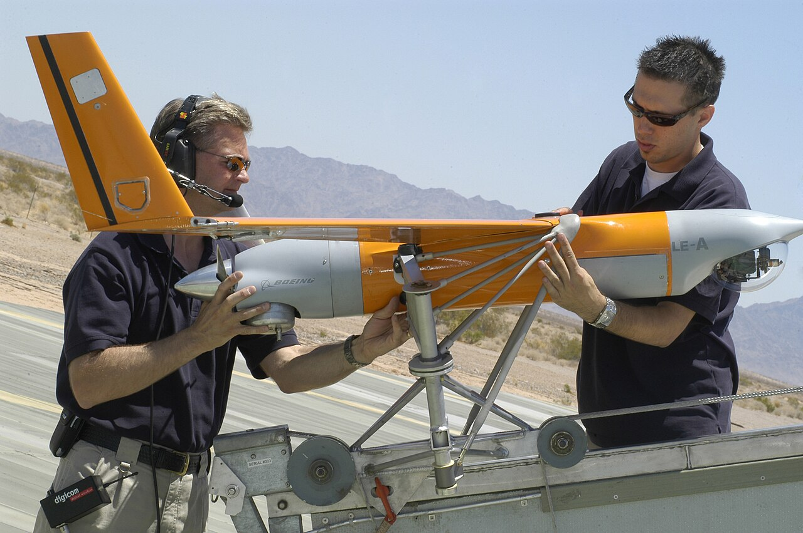
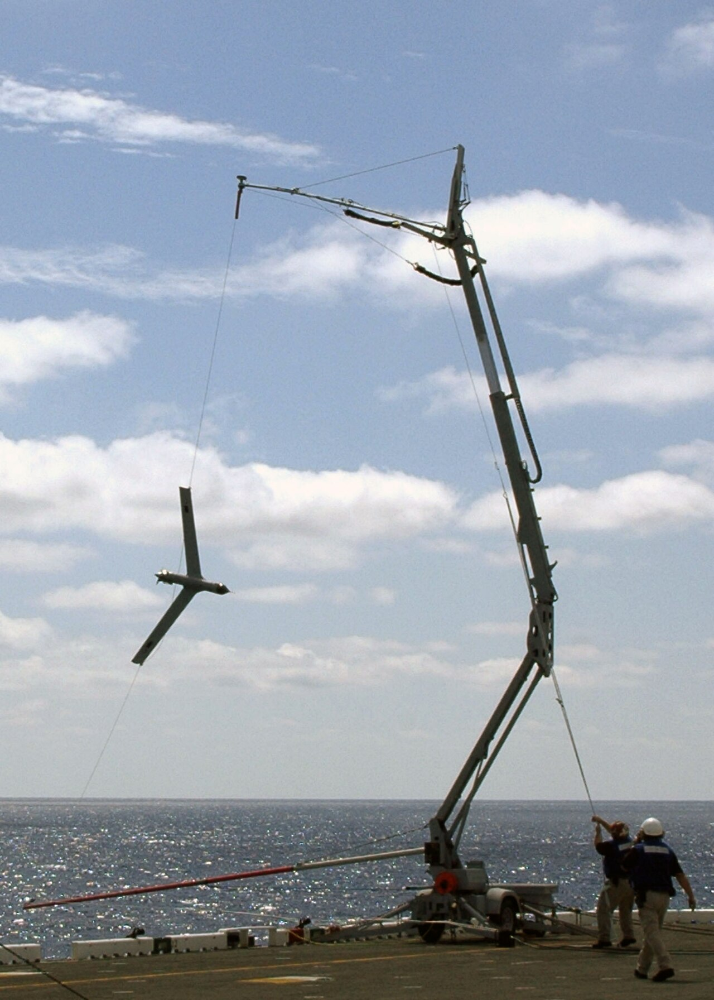
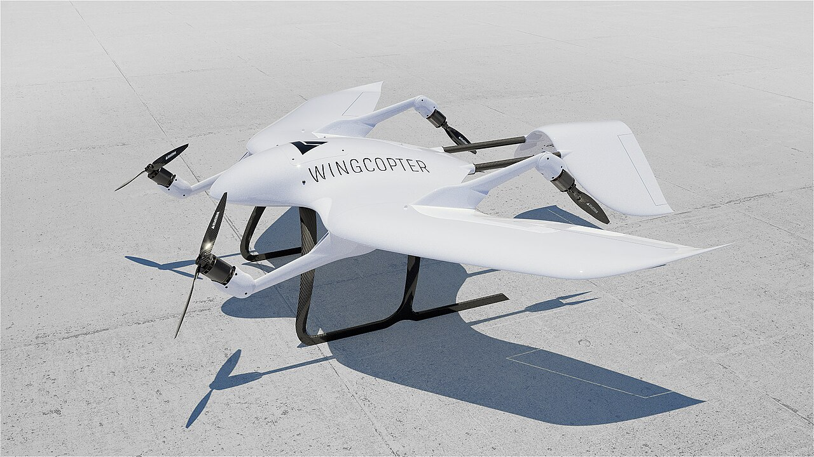

# Group 2 — Medium UAS

> **21–55 lb (9–25 kg) · < 3,500 ft AGL · < 250 kt**

The narrowest and least populated Group. It marks the point where a UAS stops being something one person carries and starts being something a small team operates — while still remaining, just barely, within civilian reach.

---

## In general

Group 2 is where a drone stops fitting in a backpack and starts needing a truck.

These aircraft weigh roughly as much as a large dog — 10 to 25 kilograms. That doesn't sound like much, but it changes the character of the whole operation. You can no longer throw one into the air by hand; it needs a catapult or a rail to reach flying speed. Many can't land conventionally either, so they're caught in nets or snagged out of the air by a cable. The aircraft becomes one component in a *system* that includes launch equipment, recovery equipment, and a small team of people who know how to run it.

What you get in return is endurance. A Group 2 aircraft can stay airborne for ten to twenty-plus hours, because at this size a small petrol engine becomes practical and liquid fuel carries far more energy than batteries. It can also carry a real sensor — a stabilised camera turret that zooms, tracks, and sees in infrared, rather than a fixed camera bolted to a frame. That combination, persistence plus a good sensor, is the entire point of the class.

It's a surprisingly empty category, and the reason is worth knowing: it's being squeezed from both sides. Electronics keep shrinking, so capability that once needed 40 pounds now fits in 15 and drops into Group 1. Meanwhile, once you've accepted the cost of a catapult and a ground crew, going bigger is comparatively cheap — so operators jump to Group 3 and get much more aircraft for the trouble. Group 2 survives mainly because of a regulatory line: **55 pounds is the legal ceiling for ordinary civilian drone operations**, so anyone who needs to stay inside the rules but wants maximum capability builds right up against it.

That makes Group 2 the practical top end of the civilian world — the biggest, most capable drone a company can fly without entering a different regulatory universe.

---

## What defines the group

Group 2 is the **team-portable** tier. Two people and a vehicle, rather than one person and a backpack.

Crossing 20 lb changes the operation qualitatively:

- **Launch usually needs equipment** — a catapult, a rail, or a bungee. Hand-launching a 25 kg aircraft is not possible.
- **Recovery usually needs equipment too** — a net, a skyhook, or a prepared landing area.
- **Endurance jumps sharply** — 10–20+ hours becomes achievable, because a larger airframe carries proportionally more fuel or battery.
- **Payloads become genuinely capable** — stabilized EO/IR turrets rather than a fixed camera.
- **Small combustion engines appear** — at this scale, liquid fuel beats batteries decisively for endurance.

The 3,500 ft AGL ceiling reflects the tactical role: high enough to see a useful area and stay clear of small-arms range, low enough to remain below most crewed traffic.

---

## Why the group is nearly empty

There are strikingly few Group 2 systems compared to Groups 1 and 3, and the reason is instructive.

**Pressure from below:** electronics, batteries, and sensors keep getting lighter. Capability that once required 40 lb now fits in 15. Systems that would have been Group 2 a decade ago are Group 1 today.

**Pressure from above:** once you've accepted that you need a catapult, a recovery system, a ground control station, and a trained crew, the marginal cost of going to 100+ lb is small — and you get far more endurance and payload for it. If you're paying the infrastructure cost anyway, you may as well buy the capability.

So Group 2 gets squeezed from both directions. It survives mainly where the **55 lb regulatory ceiling** is the binding constraint — which is to say, where someone specifically needs to stay under Part 107's weight limit.

---

## Representative systems

| System | Weight | Rough cost | Notes |
|---|---|---|---|
| **Boeing Insitu ScanEagle** | ~48.5 lb (22 kg) | **$100,000–250,000** per air vehicle | The canonical Group 2 system. 20+ hr endurance, catapult launch, SkyHook recovery. |
| **Wingcopter 198** | ~26 lb (12 kg) | **~$120,000** class | Civilian tiltrotor delivery UAV — medical logistics in Africa and the Pacific. |
| **AeroVironment Puma LE** | ~23 lb (10.4 kg) | **~$250,000** per system | Extended-endurance variant of the Puma. Hand- or rail-launched. |
| **Heavy-lift commercial multirotor** | 25–55 lb | **$20,000–80,000** | Cinema, survey, and utility inspection platforms. |

*A ScanEagle on its pneumatic catapult. This is the defining image of Group 2 — the aircraft cannot launch itself, so the launcher is part of the system. Note how much infrastructure surrounds a 48 lb aircraft.*

*ScanEagle recovery using the SkyHook system: the aircraft flies into a suspended vertical cable and snags it with a wingtip hook. It has no landing gear. That is an entirely reasonable design choice once you accept that recovery equipment exists — and it's unthinkable in Group 1.*

*A Wingcopter tiltrotor — a civilian Group 2 system. Its rotors swivel from vertical to horizontal, so it takes off like a multirotor and cruises like an aeroplane. VTOL removes the launch-and-recovery infrastructure problem, at the cost of significant mechanical complexity.*

---

## What it's good at

- **Persistent tactical ISR** — 20+ hours over a fixed area.
- **Maritime surveillance** — small deck footprint, launched and recovered from a ship.
- **Long-range delivery to unprepared sites** (the VTOL variants).
- **Utility and infrastructure inspection** over large areas.

## What it's bad at

- **Rapid deployment.** Setup means assembling a catapult and a recovery system.
- **Operating alone.** This is a crewed operation, even though the aircraft is uncrewed.
- **Cost-effectiveness against Group 1.** For many missions, several Group 1 aircraft beat one Group 2 aircraft for less money.
- **Being unobtrusive.** A catapult and a ground station are conspicuous.

---

## Why this group matters to you

Two reasons, both practical.

**1. It shows you the far edge of Part 107.** Group 2's ceiling and Part 107's ceiling are the same number — 55 lb. Everything in this group is, in principle, civilian-operable. That makes it the realistic outer bound of what an individual or small company could legally fly, and a useful sense of scale for what "the top of the civilian range" actually looks like.

**2. It illustrates infrastructure cost as a design driver.** The ScanEagle has no landing gear, because someone decided a recovery system was acceptable. That decision cascaded through the entire airframe. Your equivalent decision is smaller but structurally identical: choosing VTOL versus hand-launch determines whether you need a field, and that determines where and how often you can fly. **Launch and recovery constraints shape aircraft more than payload does** — that's the transferable lesson.

---

## Build reality check

**Not a hobby build.** A 25 kg aircraft at 250 kt carries kinetic energy comparable to a motorcycle. Component costs are 10–100× a Group 1 build, crashes are catastrophic rather than instructive, and you need launch and recovery infrastructure before the first flight.

The practical hobby ceiling sits well inside Group 1 — most self-built aircraft top out around 2–3 kg, which is roughly a third of the Group 1 limit and about a tenth of Group 2's.

---

*Next: [../03-group-3/](../03-group-3/) — past the Part 107 line.*
*Previous: [../01-group-1/](../01-group-1/) · Image sources and licenses: [zz-CREDITS.md](zz-CREDITS.md)*
