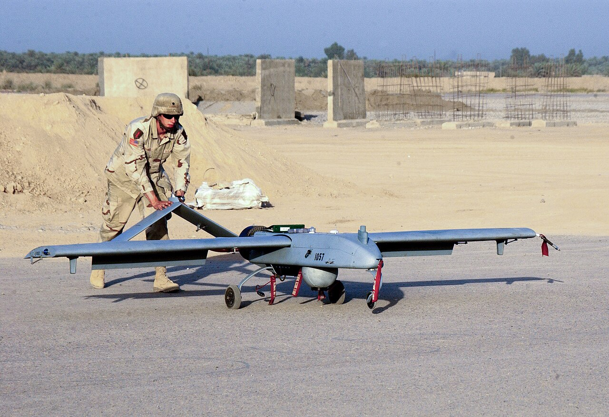
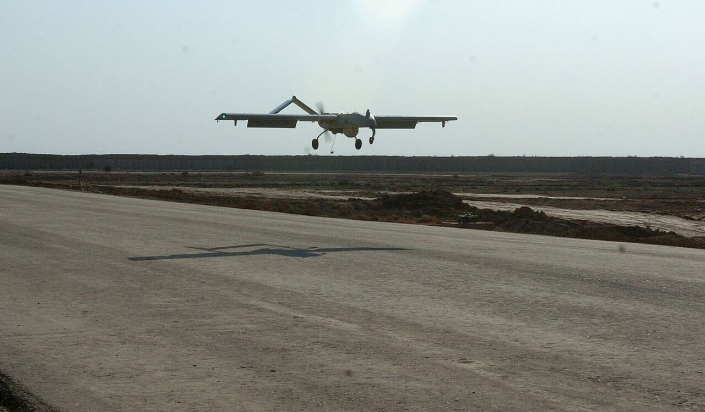
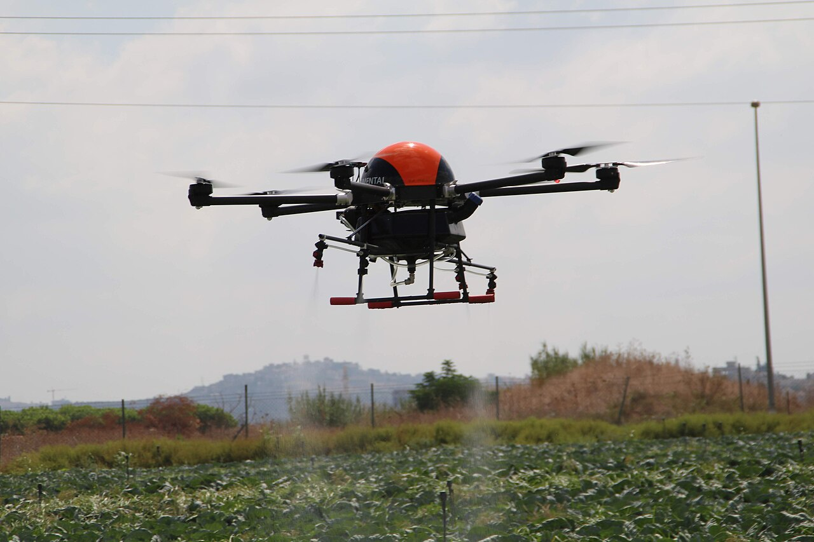

# Group 3 — Large UAS

> **55–1,320 lb (25–600 kg) · < 18,000 ft MSL · < 250 kt**

The first Group that is unambiguously beyond civilian reach, and the widest weight span in the system — a 24-fold range from 55 lb to 1,320 lb. This is where a UAS stops being equipment and becomes an *aircraft*, with the infrastructure, crew, and airspace coordination that word implies.

---

## In general

Group 3 is where a drone stops being a piece of equipment and becomes an aircraft.

The range here is wide — from something the size of a large motorcycle to something approaching a small aeroplane, roughly 25 to 600 kilograms. What unifies them isn't size so much as a shift in how they're treated. A Group 3 system needs a launcher or a runway, a shelter or a trailer, a ground control station with screens and operators, and a trained crew of anywhere from four to ten people. Setting one up takes hours. It is a deployment, not an outing.

Two things change fundamentally at this tier. The first is legal: **55 pounds is the ceiling for ordinary civilian drone operations**, and Group 3 starts exactly there. Above that line you can't simply pass a test and fly — you need a specific waiver, an exemption, or government status, each of which takes months to obtain and requires demonstrating that your aircraft and your procedures are safe. The regulatory burden doesn't grow gradually; it changes in kind.

The second is that these aircraft now share airspace with crewed aviation as a genuine participant. Altitude is measured from sea level rather than from the ground, because that's how air traffic control thinks. A 200-kilogram aircraft flying at 100 knots is a real hazard to a light aeroplane, and everyone involved plans accordingly.

The typical job is persistent surveillance over a wide area — circling for a day, handing control between operator shifts, watching. There's a civilian corner too: the largest agricultural spraying drones reach Group 3 weights when fully loaded, and their operators work under specific regulatory exemptions. That's a useful reminder that this classification measures size alone, not purpose or sophistication — a crop sprayer and a military reconnaissance aircraft can sit in the same group and share nothing else whatsoever.

---

## What defines the group

Group 3 crosses the **55 lb line**, which is the single most consequential boundary in the whole taxonomy for a civilian. Below it: Part 107. Above it: waivers, exemptions, or public-aircraft status.

What changes at this scale:

- **Altitude is now measured from sea level (MSL), not the ground.** Groups 1–2 are tactical and local. Group 3 aircraft operate in the same vertical reference frame as crewed aviation, because they share airspace with it.
- **Launch and recovery infrastructure is mandatory** — pneumatic or hydraulic catapults, arresting nets, or a runway.
- **Combustion engines are standard.** Battery-electric is not competitive at this endurance and weight.
- **A dedicated ground control station and trained crew** — often 4–10 people per system.
- **Real collision consequence.** A 467 lb aircraft at 100 kt is a genuine hazard to a crewed aircraft.

The 250 kt speed ceiling keeps Group 3 in the same regime as general aviation traffic — these are not fast aircraft, just large and persistent ones.

---

## Representative systems

| System | Weight | Rough cost | Notes |
|---|---|---|---|
| **Textron RQ-7B Shadow** | ~467 lb (212 kg) | **~$750,000** per air vehicle | Brigade-level ISR. Catapult launch, arrested landing. Long US Army service. |
| **Insitu RQ-21A Blackjack** | ~135 lb (61 kg) | **~$2M** per system | USMC/Navy expeditionary ISR. Catapult and SkyHook, like a scaled-up ScanEagle. |
| **Textron Aerosonde** | ~80 lb (36 kg) | **$500,000+** | Small runway-independent ISR aircraft. |
| **DJI Agras T40/T50** (civilian) | ~220 lb loaded (100 kg) | **$20,000–35,000** | Agricultural spray multirotor. Group 3 **by weight**, but civilian and operated under exemption. |

*An RQ-7 Shadow on its pneumatic catapult. The launcher accelerates roughly 200 kg to flying speed in a few metres. Everything about this scale requires purpose-built ground equipment — you cannot improvise it.*

*The Shadow landing on a prepared surface. Larger Group 3 aircraft use arresting gear — a tailhook and cable, much like carrier aviation — because stopping distance on an unprepared strip is otherwise prohibitive.*

*A civilian agricultural spray hexacopter. Fully loaded these reach Group 3 weights, which is why they operate under specific FAA exemptions rather than ordinary Part 107 rules. It's a useful reminder that the Group system measures size, not sophistication or purpose — this shares a weight class with a military ISR aircraft and nothing else.*

---

## What it's good at

- **Brigade- and division-level ISR** — persistent coverage of a large area, handed between operators across shifts.
- **Expeditionary operations** — runway-independent via catapult and net or hook recovery.
- **Communications relay** — loitering high enough to extend line-of-sight radio far beyond ground range.
- **Heavy civilian work under exemption** — agricultural spraying, large-scale survey.

## What it's bad at

- **Anything requiring responsiveness.** Setup and teardown are measured in hours.
- **Operating discreetly.** A catapult, a ground station, and a crew are visible from a distance.
- **Cost-per-hour.** These are expensive to operate as well as to buy.
- **Airspace flexibility.** Sharing airspace with crewed traffic means coordination, deconfliction, and approvals.

---

## Why this group matters to you

It's the **clearest illustration of what the 55 lb line actually costs**.

Below 55 lb, a civilian can fly under Part 107: pass a knowledge test, register the aircraft, follow the operating rules. Above it, the regulatory burden doesn't increase incrementally — it changes in kind. You need a waiver, an exemption, or public-aircraft status, and each of those is a months-long process involving demonstrated airworthiness and operational procedures.

The agricultural sprayer above is the interesting case precisely because it's civilian. Operators fly Group 3-weight aircraft under specific FAA exemptions, and the compliance overhead is a substantial part of the business. That's what the far side of 55 lb looks like in practice for a civilian: not impossible, but a legal and administrative undertaking rather than an aviation one.

For your project, the transferable point is that **regulatory thresholds are design constraints with real teeth.** You'll meet the same phenomenon two orders of magnitude down, at 250 g, where crossing a line changes your obligations discontinuously rather than gradually. Same structure, much smaller stakes.

---

*Next: [../04-group-4/](../04-group-4/) — heavy, armed, below the flight levels.*
*Previous: [../02-group-2/](../02-group-2/) · Image sources and licenses: [zz-CREDITS.md](zz-CREDITS.md)*
