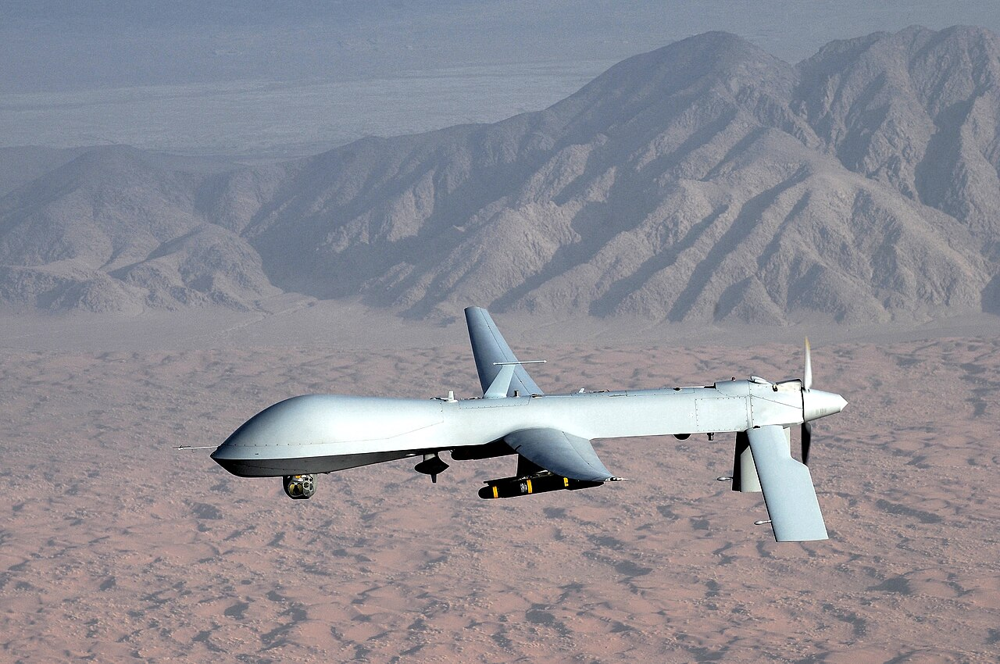
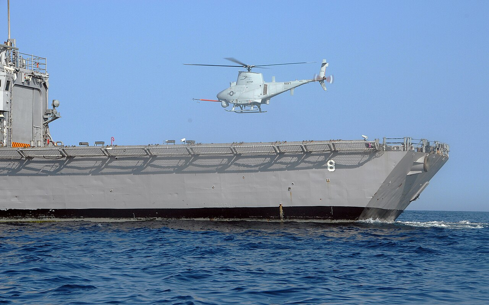

# Group 4 — Larger UAS

> **> 1,320 lb (600 kg) · < 18,000 ft MSL · any airspeed**

Aircraft-scale systems operating below the flight levels. Group 4 and Group 5 share the same weight threshold and are separated **only by altitude** — which tells you that at this scale, the meaningful distinction is no longer size but which airspace you occupy.

---

## In general

Group 4 is a real aeroplane that happens to have nobody sitting in it.

At over 1,320 pounds these are in the same weight class as a small crewed aircraft — a Cessna 172 is around 2,450 pounds — and they're treated the same way by everyone in aviation. They take off from runways, they're maintained by mechanics, they go through airworthiness processes, and they talk to air traffic control. The only thing missing from the cockpit is a person.

The pilot instead sits in a windowless room that might be on the other side of the world, flying via satellite link. This is the tier where that becomes normal rather than exceptional, and it's a genuinely strange feature of modern aviation: a crew flies a full shift, hands the aircraft to the next crew mid-mission, and drives home. The aircraft stays up for a day or more.

What these do is loiter and watch, usually with the ability to act on what they see. The MQ-1 Predator is the aircraft that established the pattern — persistent surveillance combined with weapons, so that the gap between observing something and doing something about it collapsed from hours to seconds. That capability, more than any technical specification, is why this class of aircraft became both militarily significant and politically contentious.

The line between Group 4 and Group 5 is **not size** — they share the same weight threshold. It's altitude, and specifically whether the aircraft flies above 18,000 feet. Group 4 aircraft stay below that, which means sharing crowded airspace with general aviation and constantly coordinating around it. Going higher isn't about being bigger; it's about entering a different and more tightly controlled part of the sky.

---

## What defines the group

Crossing 1,320 lb puts a UAS in the same mass class as a light crewed aircraft — a Cessna 172 has a maximum takeoff weight around 2,450 lb. From this point on, a UAS is an aircraft in every sense that matters to air traffic control, and it is treated accordingly.

What this means in practice:

- **Runways, generally.** Most Group 4 systems take off and land conventionally. Catapults don't scale to this weight.
- **Turboprop or heavy piston engines**, with endurance measured in tens of hours.
- **Satellite datalink** — beyond-line-of-sight control, so the operator may be on another continent.
- **Substantial payloads** — multi-sensor EO/IR turrets, SAR radar, signals intelligence, and in many cases weapons.
- **A full flight crew** — pilot, sensor operator, and mission coordinators, often on rotating shifts.
- **Airworthiness processes** resembling those for crewed aircraft.

**Why below 18,000 ft?** Because that's the floor of Class A airspace. Group 4 aircraft operate in the same altitude band as general aviation and much military traffic, which means constant deconfliction. They are large aircraft in busy airspace.

---

## Representative systems

| System | Weight | Rough cost | Notes |
|---|---|---|---|
| **General Atomics MQ-1 Predator** | ~2,250 lb (1,020 kg) | **~$4M** per aircraft | The system that defined the armed UAS. Retired from USAF service in 2018. |
| **General Atomics MQ-1C Gray Eagle** | ~3,600 lb (1,633 kg) | **~$8M** per aircraft | US Army development of the Predator lineage. |
| **Northrop Grumman MQ-8B Fire Scout** | ~3,150 lb (1,429 kg) | **$15–20M** per aircraft | Autonomous helicopter UAS. Rotorcraft configuration chosen specifically for shipboard operations. |
| **Northrop Grumman MQ-8C Fire Scout** | ~6,000 lb (2,722 kg) | **~$20M** | Larger Bell 407-based variant with greater endurance and payload. |

*A General Atomics MQ-1 Predator. Around 2,250 lb, roughly 24 hours endurance, and the aircraft that established the armed-UAS pattern: persistent surveillance combined with a strike capability, controlled via satellite from thousands of miles away.*

*An MQ-8B Fire Scout over the deck of USS McInerney. A useful illustration that Group assignment says nothing about configuration — this is a helicopter and the Predator is a fixed-wing, and both sit in Group 4. The rotorcraft configuration was chosen because it can land on a pitching deck in a confined space, which no fixed-wing of this size can do.*

---

## What it's good at

- **Persistent armed overwatch** — loiter for many hours with the ability to act immediately.
- **Wide-area surveillance** with multiple sensor types simultaneously.
- **Shipboard operations** (the rotorcraft variants) — autonomous landing on a moving deck.
- **Beyond-line-of-sight operations** — satellite control decouples the operator from the theatre entirely.

## What it's bad at

- **Contested airspace.** Large, slow, and non-stealthy. Group 4 systems depend on air superiority.
- **Cost.** Millions per aircraft, plus a large operating apparatus.
- **Airspace integration.** Operating below FL180 means constant coordination with crewed traffic — a persistent operational friction.
- **Rapid deployment.** These need runways and a substantial support footprint.

---

## Why this group matters to you

Almost nothing here transfers to a hobby build. Include it for two conceptual points.

**1. Configuration is genuinely independent of Group.** The Predator and the Fire Scout are both Group 4 and are completely different aircraft — one fixed-wing, one helicopter — chosen for different operational constraints. This is the clearest demonstration in the whole survey that **the Group system does not describe what an aircraft is, only how big it is and where it flies.** The same is true down in Group 1, where a nano-helicopter and a quadplane share a category. Your configuration decision is a separate axis, and the taxonomy will not make it for you.

**2. Rotorcraft-versus-fixed-wing logic scales invariantly.** The Fire Scout is a helicopter because it must land in a confined, moving space. The Predator is a fixed-wing because it must loiter efficiently for a day. That is precisely the multirotor-versus-fixed-wing trade you face at 650 grams — hover capability against endurance — and it resolves the same way at 3,000 lb as it does in a park. The physics doesn't care about scale.

---

*Next: [../05-group-5/](../05-group-5/) — the flight levels.*
*Previous: [../03-group-3/](../03-group-3/) · Image sources and licenses: [zz-CREDITS.md](zz-CREDITS.md)*
