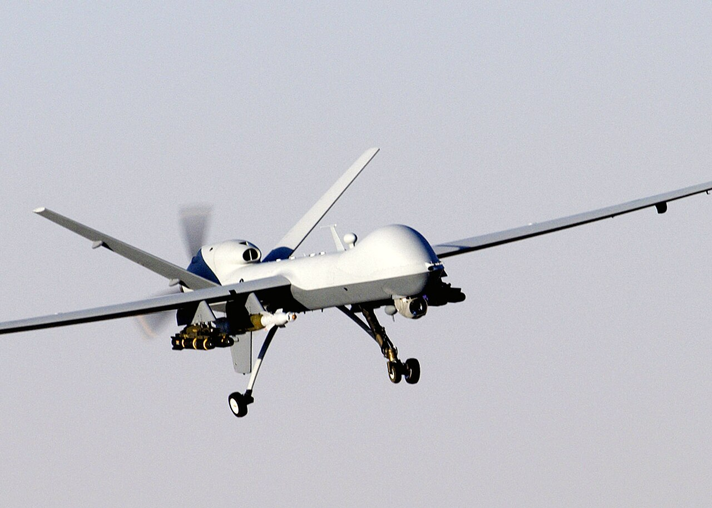
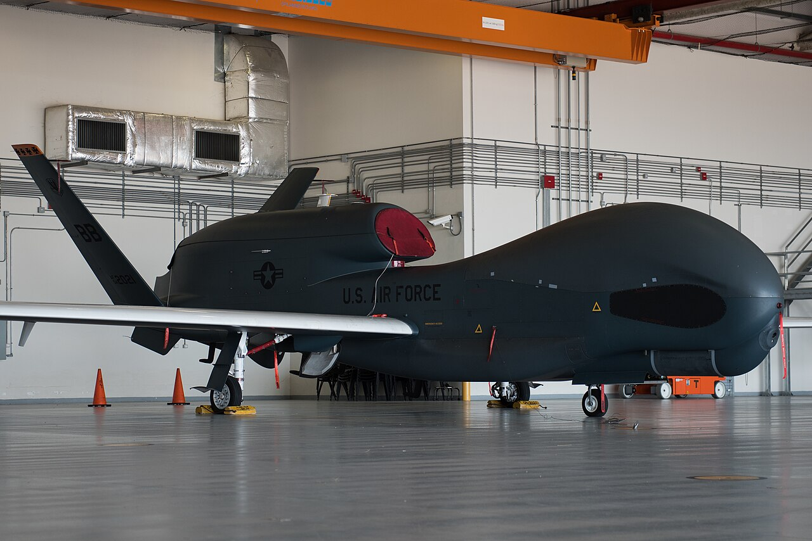

# Group 5 — Largest UAS

> **> 1,320 lb (600 kg) · > 18,000 ft MSL · any airspeed**

The strategic tier. Same weight threshold as Group 4 — the only thing that separates them is **altitude**, and specifically whether the aircraft operates above Flight Level 180, the floor of Class A airspace.

---

## In general

Group 5 is the airliner-sized end of the scale, flying higher than airliners do.

Some of these aircraft are genuinely enormous. The RQ-4 Global Hawk has a wingspan wider than a Boeing 737's and weighs about 32,000 pounds. It cruises above 60,000 feet — roughly twice the altitude of a passenger jet, in air so thin it needs that vast wing simply to stay up — and it stays there for more than thirty hours at a time.

The thing that separates Group 5 from Group 4 isn't weight; both start at the same 1,320 pounds. It's **altitude**. Above 18,000 feet you enter Class A airspace, where every aircraft flies on instruments under direct air traffic control. There's no informal flying up there, no seeing-and-avoiding. An aircraft operating in that band isn't working around crewed aviation — it's participating in the same system on the same terms, with the same certification and procedural demands that implies.

Flying that high buys two things: you're above the weather, and you're above most threats. From 60,000 feet a single aircraft can watch an area the size of a small country, and it can do so for well over a day, with ground crews rotating beneath it.

These are strategic assets in the literal sense — tasked at national level, costing anywhere from $30 million to $180 million each, supported by satellite bandwidth and a substantial organisation. There are relatively few of them, and their missions are decided far above the level of whoever might want the imagery.

For your purposes, the only useful thing here is the sense of scale. The same classification system that contains a 33-gram pocket helicopter also contains this — a spread of roughly 440,000 to 1 in weight. Both are called drones. That should tell you how little the word conveys on its own.

---

## What defines the group

Above 18,000 ft MSL, all traffic in US airspace operates under instrument flight rules with positive air traffic control. An aircraft flying there isn't coordinating around crewed aviation — it is **participating in the crewed air traffic system as a peer**, subject to the same clearances and procedures.

That single fact drives everything about Group 5:

- **Certified airworthiness and full ATC integration**, comparable to an airliner's.
- **Very high altitude** — typically 40,000–60,000 ft, above weather and most air defence.
- **Very long endurance** — 24 to 40+ hours is routine.
- **Turbofan or high-altitude turboprop** propulsion.
- **Satellite command and control**, always. Line-of-sight is irrelevant at these ranges.
- **Strategic rather than tactical roles** — theatre-wide or global coverage, tasked at national level.
- **Very large airframes.** The RQ-4 Global Hawk's wingspan is about 130 ft — wider than a Boeing 737's.

---

## Representative systems

| System | Weight | Rough cost | Notes |
|---|---|---|---|
| **General Atomics MQ-9 Reaper** | ~10,500 lb (4,760 kg) | **~$30M** per aircraft | 50,000 ft ceiling, 14–27 hr endurance. The current standard armed ISR platform. |
| **Northrop Grumman RQ-4 Global Hawk** | ~32,250 lb (14,628 kg) | **$130M+** per aircraft | 60,000 ft, 32+ hr, ~130 ft wingspan. Strategic wide-area reconnaissance. |
| **Northrop Grumman MQ-4C Triton** | ~32,250 lb (14,628 kg) | **~$180M** per aircraft | Maritime patrol derivative of the Global Hawk. |
| **General Atomics MQ-20 Avenger** | ~18,200 lb (8,255 kg) | **~$15M** | Jet-powered, low-observable. Points toward the next generation. |

*A General Atomics MQ-9 Reaper. Around 10,500 lb with a 50,000 ft ceiling — the altitude is what puts it in Group 5 rather than Group 4, since it comfortably exceeds the weight threshold either way.*

*A Northrop Grumman RQ-4 Global Hawk. About 32,000 lb with a wingspan wider than a 737's, cruising above 60,000 ft for more than 30 hours. The enormous high-aspect-ratio wing is the visual signature of an aircraft optimised for endurance at extreme altitude, where the air is thin enough that a very large wing is required to generate lift at all.*

---

## What it's good at

- **Strategic reconnaissance** — theatre- or continent-scale coverage from a single aircraft.
- **Persistent maritime patrol** — monitoring vast ocean areas continuously.
- **Operating above weather and most threats** — 60,000 ft is above nearly all civil aviation and much air defence.
- **Multi-day coverage** with crew rotation on the ground rather than in the air.

## What it's bad at

- **Cost.** $30M–180M per aircraft, plus satellite bandwidth, plus a large ground apparatus.
- **Survivability against a peer adversary.** Large, slow, and mostly non-stealthy.
- **Flexibility.** These are strategic assets tasked at national level, not responsive to local needs.
- **Basing.** They need long runways and extensive infrastructure.

---

## Why this group matters to you

Nothing here is remotely applicable to a personal project. It's worth reading for one reason: **it completes the scale.**

The full span of the taxonomy runs from a **33-gram Black Hornet** to a **32,000-pound Global Hawk** — a factor of roughly **440,000 in mass**, all within one classification system. Both are uncrewed aircraft. Both are called drones. They share essentially nothing else.

That range is the most useful thing the DoD Group system gives a newcomer: a concrete sense of just how large and heterogeneous "drone" is as a category, and therefore how little the word conveys on its own. When someone says they're building a drone, the word has narrowed the field by almost nothing until you know the weight, the configuration, and the mission.

Your project sits at the very bottom of Group 1 — around **0.002%** of the weight of the largest aircraft in the same taxonomy.

---

*Previous: [../04-group-4/](../04-group-4/) · Next: [../99-comparison.md](../99-comparison.md)*
*Image sources and licenses: [zz-CREDITS.md](zz-CREDITS.md)*
